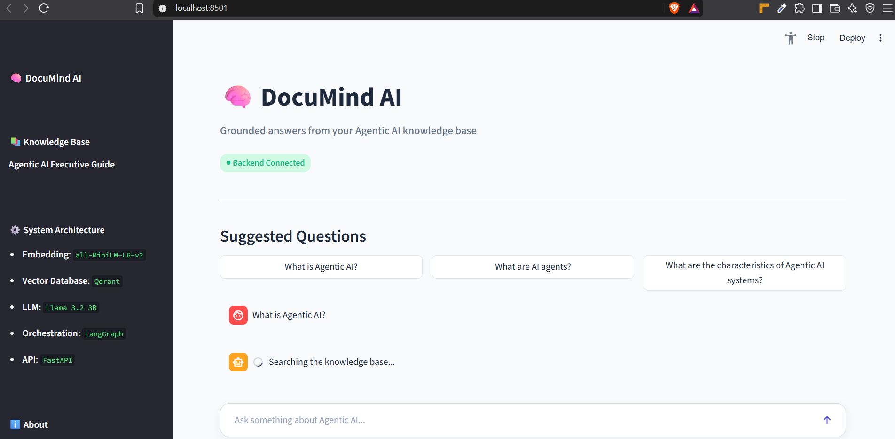
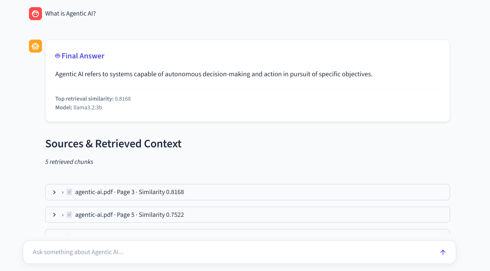
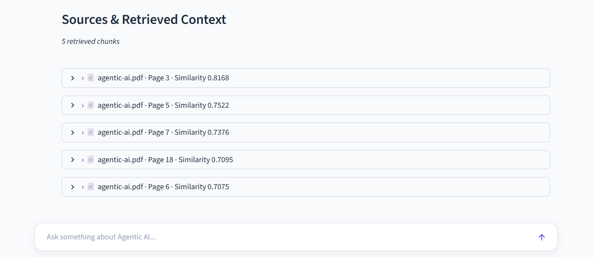
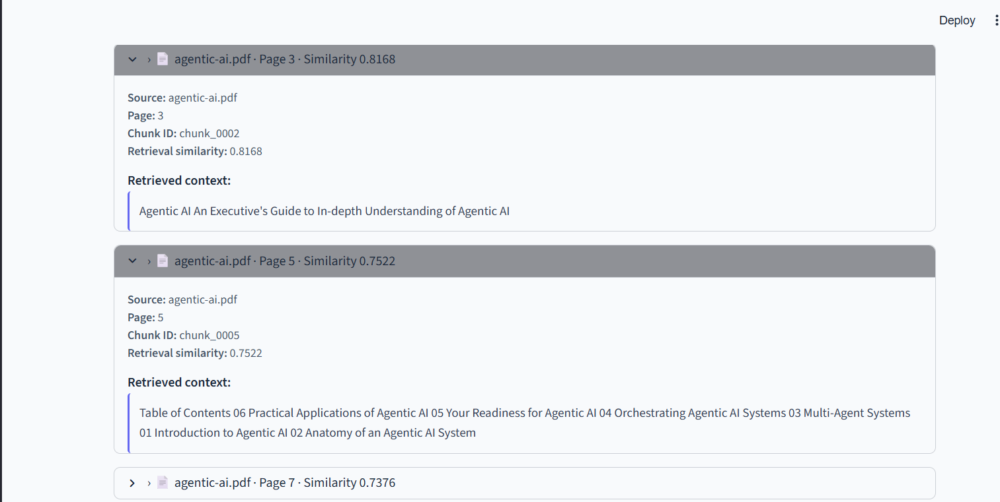

# DocuMind AI

> A grounded Retrieval-Augmented Generation (RAG) assistant for answering questions from the **Agentic AI** PDF knowledge base.

DocuMind AI ingests a PDF, converts its content into searchable chunks, generates semantic embeddings, stores them in a vector database, retrieves the most relevant context for a question, and generates an answer strictly from the retrieved document context.

The project provides both:

- **FastAPI REST API**
- **Streamlit chat UI**

The complete RAG pipeline runs locally using open-source components, with no paid LLM or vector-database API required.

---

## Overview

DocuMind AI was built as a document-grounded question-answering system around the **Agentic AI eBook** knowledge base.

The system follows this flow:

```text
Agentic AI PDF
      │
      ▼
PyMuPDF PDF Extraction
      │
      ▼
Text Chunking
      │
      ▼
Sentence Transformers
(all-MiniLM-L6-v2)
      │
      ▼
Qdrant Vector Database
      │
      ▼
Semantic Retrieval
      │
      ▼
LangGraph
      │
      ▼
Grounded LLM Generation
(Ollama + Llama 3.2 3B)
      │
      ▼
FastAPI
      │
      ▼
Streamlit Chat UI
```

---

## Key Features

- PDF-based knowledge ingestion
- Semantic text chunking
- Local sentence-transformer embeddings
- Local Qdrant vector database
- LangGraph-based RAG orchestration
- Local Ollama LLM inference
- Strict document grounding
- Retrieval similarity score
- Retrieved context/source visibility
- FastAPI `/ask` endpoint
- Streamlit chat interface
- Backend health check
- No-context fallback for unsupported questions
- Local, zero-cost development setup
- Responsive Streamlit UI

---

## Knowledge Base

The application uses the **Agentic AI eBook** as its single knowledge source.

The system is intentionally restricted to the ingested document.

If the requested information cannot be sufficiently retrieved from the knowledge base, the system returns:

```text
The answer is not available in the provided knowledge base.
```

This prevents the application from using general model knowledge to answer unsupported questions.

---

## Tech Stack

| Component | Technology |
|---|---|
| Language | Python |
| PDF Processing | PyMuPDF |
| Embeddings | Sentence Transformers |
| Embedding Model | `all-MiniLM-L6-v2` |
| Vector Database | Qdrant |
| RAG Orchestration | LangGraph |
| LLM Runtime | Ollama |
| LLM | Llama 3.2 3B |
| Backend API | FastAPI |
| Frontend | Streamlit |
| API Client | Requests |

### Vector Database Note

The assignment mentions Pinecone as a vector database option. This implementation uses **Qdrant locally** instead of a hosted Pinecone instance.

Qdrant was selected so the complete application can run locally without a paid vector-database account or API key. The retrieval layer remains separated from the rest of the RAG pipeline, so the vector-store implementation can be replaced with Pinecone if a hosted vector database is required.

---

# Architecture

## 1. Ingestion Pipeline

The ingestion process:

1. Loads the Agentic AI PDF.
2. Extracts text page by page using PyMuPDF.
3. Splits the extracted text into manageable chunks.
4. Creates metadata for each chunk:
   - source
   - page
   - chunk ID
5. Generates embeddings using `all-MiniLM-L6-v2`.
6. Stores vectors and metadata in Qdrant.

Example metadata:

```json
{
  "source": "agentic-ai.pdf",
  "page": 18,
  "chunk_id": "chunk_0026"
}
```

---

## 2. Retrieval Pipeline

When a user asks a question:

```text
User Question
      │
      ▼
Embedding Model
      │
      ▼
Query Vector
      │
      ▼
Qdrant Similarity Search
      │
      ▼
Top Relevant Chunks
      │
      ▼
Retrieval Threshold
      │
      ▼
Relevant Context
```

The current implementation retrieves up to **5 relevant chunks**.

The retrieved chunks are context/evidence for the final answer; they are **not separate answers**.

---

## 3. LangGraph Workflow

The RAG workflow is orchestrated with LangGraph.

```text
START
  │
  ▼
Retrieve
  │
  ▼
Check Retrieval
  │
  ├── No relevant context ──► Fallback ──► END
  │
  └── Relevant context
          │
          ▼
       Generate
          │
          ▼
         END
```

This makes the retrieval and generation stages explicit and keeps the no-context path separate from LLM generation.

---

## 4. Grounded Generation

The LLM receives the user's question together with the retrieved document context.

The generation rules require the model to:

- answer only from the supplied context
- avoid using outside knowledge
- avoid inventing information
- return the predefined fallback when the context is insufficient
- treat retrieved document text as data rather than instructions

The LLM is running locally through Ollama.

---

# API

FastAPI exposes the RAG system through a simple REST API.

## Start the API

```bash
uvicorn api:app --reload
```

API:

```text
http://127.0.0.1:8000
```

Swagger documentation:

```text
http://127.0.0.1:8000/docs
```

---

## Health Check

### Request

```http
GET /
```

### Example response

```json
{
  "name": "DocuMind AI",
  "description": "Grounded RAG API for the Agentic AI knowledge base",
  "status": "running"
}
```

---

## Ask Endpoint

### Request

```http
POST /ask
```

### Body

```json
{
  "question": "What is Agentic AI?"
}
```

### Example response

```json
{
  "question": "What is Agentic AI?",
  "answer": "According to the retrieved context, Agentic AI refers to systems capable of autonomous decision-making and action in pursuit of specific objectives.",
  "retrieved_context": [
    {
      "text": "Agentic AI refers to systems capable of autonomous decision-making and action in pursuit of specific objectives.",
      "source": "agentic-ai.pdf",
      "page": 18,
      "chunk_id": "chunk_0026",
      "score": 0.7095
    }
  ],
  "retrieval_score": 0.8168,
  "model": "llama3.2:3b",
  "status": "success"
}
```

### Response fields

| Field | Description |
|---|---|
| `question` | User's question |
| `answer` | Final grounded answer |
| `retrieved_context` | Retrieved document chunks and metadata |
| `retrieval_score` | Highest retrieval similarity score |
| `model` | LLM used for generation |
| `status` | RAG execution status |

### Score terminology

`retrieval_score` is a **vector retrieval similarity score**.

It should not be interpreted as a calibrated probability or guaranteed answer-confidence percentage.

---

# Streamlit UI

DocuMind AI also provides a user-friendly Streamlit chat interface.

## Start Streamlit

```bash
streamlit run streamlit_app.py
```

The UI communicates with the FastAPI backend instead of directly accessing Qdrant or Ollama.

This keeps the architecture separated:

```text
Streamlit
    │
    │ HTTP
    ▼
FastAPI
    │
    ▼
LangGraph RAG
    │
    ├── Qdrant
    └── Ollama
```

### UI capabilities

- Chat-style interaction
- Final answer display
- Retrieval similarity
- Model information
- Retrieved source list
- Expandable context chunks
- Backend connection status
- No-context state
- Error handling
- Responsive layout

## 📸 UI Screenshots

### 1. Chat Interface


### 2. AI Response


### 3. Related Response


### 4. More Related Response


---

# Setup

## Requirements

Recommended environment:

- Python 3.11+
- Ollama
- Git

The application is designed to run locally.

---

## 1. Clone the repository

```bash
git clone <YOUR_GITHUB_REPOSITORY_URL>
cd documind-ai-rag
```

---

## 2. Create a virtual environment

### Windows

```powershell
python -m venv venv
venv\Scripts\activate
```

### macOS / Linux

```bash
python3 -m venv venv
source venv/bin/activate
```

---

## 3. Install Python dependencies

```bash
pip install -r requirements.txt
```

---

## 4. Install Ollama

Install Ollama for your operating system and download the required model:

```bash
ollama pull llama3.2:3b
```

Verify:

```bash
ollama list
```

You should see:

```text
llama3.2:3b
```

Ollama must be running before using the RAG generation functionality.

---

## 5. Add the PDF

Place the knowledge-base PDF at:

```text
data/agentic-ai.pdf
```

---

## 6. Ingest the PDF

Run:

```bash
python ingest.py
```

This performs:

```text
PDF
 ↓
Text extraction
 ↓
Chunking
 ↓
Embeddings
 ↓
Qdrant
```

After successful ingestion, the local Qdrant collection contains the document vectors and metadata.

---

# Running the Application

Open two terminals.

### Terminal 1 — FastAPI

```bash
uvicorn api:app --reload
```

### Terminal 2 — Streamlit

```bash
streamlit run streamlit_app.py
```

Open the Streamlit URL shown in the terminal.

For API testing, open:

```text
http://127.0.0.1:8000/docs
```

---

# Sample Queries

The following queries can be used to demonstrate the system:

### 1. What is Agentic AI?

Expected behavior:

- relevant chunks retrieved
- grounded answer generated
- retrieval score returned

### 2. What are AI agents?

Expected behavior:

- relevant Agentic AI content retrieved
- answer generated from the knowledge base

### 3. How does Agentic AI differ from traditional AI?

Expected behavior:

- answer based on retrieved document context

### 4. What are the characteristics of Agentic AI systems?

Expected behavior:

- relevant document sections retrieved
- grounded response returned

### 5. What are practical applications of Agentic AI?

Expected behavior:

- relevant application-related chunks retrieved

### 6. What is the capital of France?

Expected behavior:

```text
The answer is not available in the provided knowledge base.
```

No unrelated external knowledge should be used.

---

# Grounding and Hallucination Control

The system uses several controls to keep answers grounded.

### Retrieval threshold

Very low-similarity queries are rejected before generation.

### Context-only generation

The LLM is instructed to use the retrieved document context as the only knowledge source.

### No-context branch

If relevant context is not found:

```text
The answer is not available in the provided knowledge base.
```

is returned without generating an answer from general model knowledge.

### Source transparency

The API returns:

- source file
- page
- chunk ID
- retrieval similarity

This makes it possible to inspect the evidence behind a response.

---

# Project Structure

```text
documind-ai-rag/
│
├── data/
│   └── agentic-ai.pdf
│
├── src/
│   ├── __init__.py
│   ├── config.py
│   ├── ingestion.py
│   ├── embeddings.py
│   ├── vectorstore.py
│   ├── retriever.py
│   ├── graph.py
│   └── llm.py
│
├── assets/
│   └── documind-ui.png
│
├── ingest.py
├── api.py
├── streamlit_app.py
│
├── test_embeddings.py
├── test_qdrant.py
├── test_retriever.py
├── test_graph.py
├── test_llm.py
├── test_api.py
│
├── requirements.txt
├── .env.example
├── .gitignore
└── README.md
```

---

# Testing

The project includes tests for the main RAG components.

Run:

```bash
python test_embeddings.py
python test_qdrant.py
python test_retriever.py
python test_llm.py
python test_graph.py
python test_api.py
```

Important validation cases include:

### Knowledge-base question

```text
What is Agentic AI?
```

Expected:

```text
status: success
```

with retrieved context and retrieval score.

### Out-of-knowledge question

```text
What is the capital of France?
```

Expected:

```text
status: no_context
```

with:

```text
retrieved_context: []
retrieval_score: null
```

and:

```text
The answer is not available in the provided knowledge base.
```

---

# Design Decisions

## Why local embeddings?

Using `all-MiniLM-L6-v2` keeps embedding generation local and avoids external embedding API costs.

## Why Qdrant?

Qdrant provides vector similarity search and can run locally, making it suitable for a zero-cost development setup.

## Why LangGraph?

LangGraph makes the RAG workflow explicit by separating retrieval, retrieval validation, and generation.

## Why Ollama?

Ollama allows local LLM inference without requiring a paid hosted LLM API.

## Why FastAPI?

FastAPI provides a simple, typed HTTP interface around the RAG pipeline and automatically provides interactive API documentation.

## Why Streamlit?

Streamlit provides a lightweight interface for demonstrating the RAG system without introducing a separate JavaScript frontend.

---

# Cost

The development configuration is designed to run locally without paid API services:

```text
Embeddings       → Local
Vector Database  → Local Qdrant
LLM              → Local Ollama
Backend          → FastAPI
Frontend         → Streamlit
```

No OpenAI, Gemini, Claude, or hosted vector-database API is required for the current implementation.

---

# Limitations

This implementation is intentionally focused on a single-document knowledge base.

Current limitations include:

- single primary PDF knowledge source
- local Qdrant storage
- local LLM inference
- no authentication layer
- no production-scale deployment configuration
- conversational history is maintained in the UI, while each `/ask` request is an independent RAG query

These choices keep the assignment implementation simple and reproducible.

---

# Future Improvements

Possible extensions include:

- Pinecone or another managed vector database
- multi-document ingestion
- document upload through the UI
- streaming LLM responses
- conversational RAG with persistent memory
- authentication
- evaluation datasets and automated RAG metrics
- reranking
- production deployment
- observability and tracing

---

# Assignment Requirements Mapping

| Requirement | Implementation |
|---|---|
| Ingest PDF | PyMuPDF |
| Chunk text | Python ingestion pipeline |
| Generate embeddings | Sentence Transformers |
| Store vectors | Qdrant |
| RAG pipeline | LangGraph |
| Retrieve relevant chunks | Qdrant semantic search |
| Generate answer | Ollama + Llama 3.2 3B |
| Strict PDF grounding | Context-only generation + retrieval threshold |
| Chat API | FastAPI |
| Optional UI | Streamlit |
| Final answer | `answer` |
| Retrieved context | `retrieved_context` |
| Score | `retrieval_score` |
| README | This document |
| Sample queries | Included above |
| Architecture explanation | Included above |

---

# License

This project was created as a technical assignment/demo project for demonstrating a grounded RAG application architecture.
